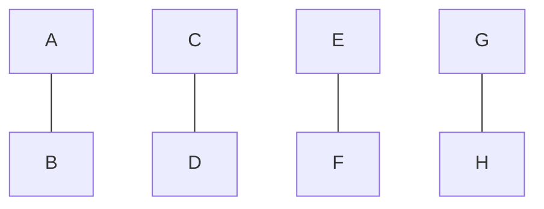

- # 探索による問題解決
  - 計算機に要る問題解決
      - 人工知能が対象とする問題は様々
        - 人間が対象としている問題
          - ほとんど人口知能の研究対象
        - 人間は試行錯誤的に解いている
      - 解き方を見出すには問題自身を知る必要がある
        - コンピュータは融通が効かない
          - コンピュータにわかるような曖昧生の内容ものにする
          - 形式的な表現しかわからない
  - 問題を表現する
    - ここでは
      - 求めたいものの個数を記号で表す
      - 記号間の関係を記述
        - 方程式という記述言語を使用
      - さらに解くための演算や操作に関するルールを定義
    - 問題を適切に表現する
      - 本当に必要な条件かどうかを整理する必要がある
  - ## 状態空間表現
      - 解となりうる状態がたくさんあるある
      - 初期状態
      - 目標状態
        - わからないこともある
      - 状態繊維が可能かどうか
        - アクション
        - ルール
      - 探索問題
        - 展開と選択をやる

5回
まずA-B,C-D,E-F,G-Hでそれぞれ比べます。そして今回は1枚だけ重さが違う偽物があるので、上で比べたものの中で一つだけ天秤が釣り合わないものがでます(ここではxとyとます)。その組み合わせの片方xと釣り合ったもののうちの一つを比べます。その結果もしも釣り合わなかったらxが偽となり、釣り合ったならyが偽となります。以上で5回だと考えました。